


<a href="https://ai-resume-builder-seven-woad.vercel.app"></a><a href="https://tanvirrafi.vercel.app"></a>
<a href="https://ecoworld-climate-solutions.vercel.app"></a><a href="https://photobooth-two-phi.vercel.app/"></a>
<a href="https://nier-automata-website.vercel.app/"></a><a href="https://github.com/Tanvir-Rafi03?tab=repositories"></a>

<a href="https://tanvirrafi.vercel.app"></a><a href="mailto:tmrafi@myseneca.ca"></a><a href="https://github.com/Tanvir-Rafi03"></a><a href="https://linkedin.com"></a>

