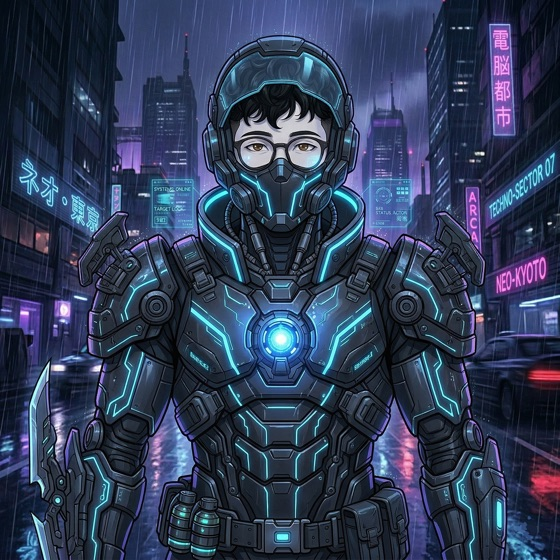

<div align="center">



<br>

 [](https://github.com/Tanvir-Rafi03?tab=followers) [](https://tanvirrafi.vercel.app) [](mailto:tmrafi@myseneca.ca)

</div>



## `01 //` SYSTEM_BOOT

```console
CYBERDECK OS v3.7.1 — QUANTUM CORE
──────────────────────────────────────────────────
[SYS]  Booting neural interface..............  [ OK ]
[MEM]  Allocating memory banks (16 GB)........  [ OK ]
[NET]  Establishing secure uplink.............  [ OK ]
[SEC]  Verifying cryptographic signature......  [ OK ]
[ENV]  Injecting environment variables........  [ OK ]
──────────────────────────────────────────────────
[ID ]  TANVIR MAHMUD RAFI
[ROL]  FULL-STACK DEVELOPER
[LOC]  TORONTO, CANADA
[STA]  ONLINE  ●  READY
──────────────────────────────────────────────────
OPERATOR PROFILE MOUNTED...
```


## `02 //` WHOAMI

<table>
<tr>
<td width="30%" align="center" valign="top">


`ID:0042` · `● ACTIVE`

</td>
<td width="70%" valign="top">

```console
$ whoami --verbose

  handle    Tanvir Mahmud Rafi
  role      Full-Stack Developer · UI/UX Designer
  base      Toronto, Canada
  studying  Computer Science
  stack     TypeScript · React · Node · PostgreSQL · Tailwind
  building  tools that matter
  status    ● ONLINE — open to opportunities
```

I build modern, responsive, interactive web interfaces — with a bias toward
**clean design**, **smooth motion**, and code that stays fast under load.
Currently combining creativity with engineering to ship products that are
both beautiful and functional.

</td>
</tr>
</table>

<details>
<summary><b><code>◢ ENGAGE COMBAT MODE</code></b></summary>

<br>
<div align="center">



`SYSTEMS ONLINE` · `TARGET LOCK` · `NEO-KYOTO // TECHNO-SECTOR 07`

</div>
</details>


## `03 //` ARSENAL

<div align="center">

**`FRONTEND`**

     

**`BACKEND`**

      

**`TOOLS`**

     

</div>


## `04 //` TELEMETRY

<div align="center">

[](https://github.com/Tanvir-Rafi03/Portfolio/commits) [](https://github.com/Tanvir-Rafi03?tab=repositories) [](https://github.com/Tanvir-Rafi03)

<br><br>


</div>


## `05 //` DEPLOYED_SYSTEMS

| # | Project | Stack | Links |
|:--:|:--|:--|:--|
| `01` | **Portfolio** <br><sub>Cyberpunk HUD portfolio — boot sequence, command palette, particle net</sub> | `React 19` `Vite 7` `Lenis` | [Live](https://tanvirrafi.vercel.app) · [Code](https://github.com/Tanvir-Rafi03/Portfolio) |
| `02` | **AI Resume Builder** <br><sub>AI-powered resume generation, formatting and tailoring</sub> | `TypeScript` `React` `PostgreSQL` | [Live](https://ai-resume-builder-seven-woad.vercel.app) · [Code](https://github.com/Tanvir-Rafi03/Ai-Resume-Builder) |
| `03` | **EcoWorld** <br><sub>Climate-solutions showcase, full-stack with REST routes</sub> | `Node` `Express` `PostgreSQL` | [Live](https://ecoworld-climate-solutions.vercel.app) · [Code](https://github.com/Tanvir-Rafi03/ecoworld-climate-solutions) |
| `04` | **Photobooth** <br><sub>Fish-themed Electron desktop photobooth with retro strips</sub> | `Electron` `JavaScript` | [Live](https://photobooth-two-phi.vercel.app/) · [Code](https://github.com/Tanvir-Rafi03/Photobooth) |
| `05` | **NieR: Automata** <br><sub>Cinematic fan tribute with fluid dystopian motion</sub> | `HTML` `CSS` `JS` | [Live](https://nier-automata-website.vercel.app/) · [Code](https://github.com/Tanvir-Rafi03/nier-automata-website) |
| `06` | **`SOMETHING COOL`** <br><sub>`BUILDING ● ● ●`</sub> | `???` | `// NEXT_PROJECT` |


## `06 //` UPLINK

<div align="center">

[](https://tanvirrafi.vercel.app) [](mailto:tmrafi@myseneca.ca) [](https://linkedin.com) [](https://maps.google.com/?q=Toronto,Canada)

<br>

`● OPEN TO OPPORTUNITIES`

<sub>

`< tanvir />` — Building cool things with code.

</sub>

</div>
